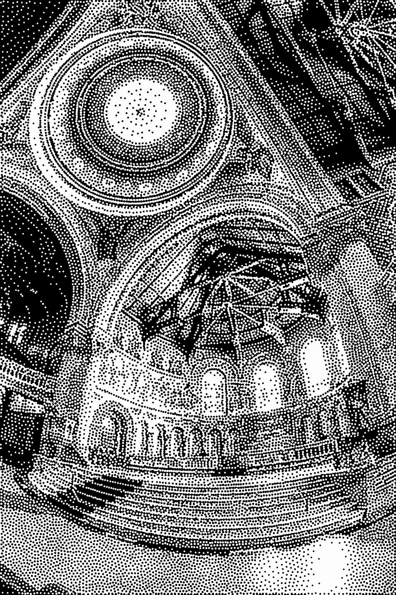

# Multi-Class Inverted Stippling

A reusable library and interactive playground application for the algorithm proposed in our SIGGRAPH Asia 2021 technical paper.

<div align="center">




</div>

## Disclaimer

This is a cleaned-up version of the GPU-based code that was used to generate the images and timings in the paper, i.e., results should be similar but may vary. The code has quite a few experimental and deactivatable features that are not mentioned in the paper, e.g., various annealing parameters (have little impact), NN-based stipple merging instead of removal (can help in corner cases, but is really complicated), fast generation of sampling maps (see our [foveated volume rendering](https://diglib.eg.org/handle/10.2312/evs20191172) paper for details), a convolution-based stippling model (has more control over packing/filling than the difference model but is trickier to implement), and so on. See pseudo code in the paper for an easy-to-understand version. That being said, the code is written to be readable, extensible, and reusable.

## Citation

```bibtex
@article{Schulz2021MultiClass,
    abstract = {We introduce inverted stippling, a method to mimic an inversion technique used by artists when performing stippling. To this end, we extend Linde-Buzo-Gray (LBG) stippling to multi-class LBG (MLBG) stippling with multiple layers. MLBG stippling couples the layers stochastically to optimize for per-layer and overall blue-noise properties. We propose a stipple-based filling method to generate solid color backgrounds for inverting areas. Our experiments demonstrate the effectiveness of MLBG in terms of reducing overlapping and intensity accuracy. In addition, we showcase MLBG with color stippling and dynamic multi-class blue-noise sampling, which is possible due to its support for temporal coherence.},
    author = {Schulz, Christoph and Kwan, Kin Chung and Becher, Michael and Baumgartner, Daniel and Reina, Guido and Deussen, Oliver and Weiskopf, Daniel},
    title = {Multi-Class Inverted Stippling},
    year = {2021},
    month = {dec},
    volume = {40},
    number = {6},
    issn = {0730-0301},
    doi = {10.1145/3478513.3480534},
    journal = {ACM Trans. Graph.},
    articleno = {245},
    numpages = {12},
    keywords = {stippling, linde-buzo-gray-algorithm, voronoi diagram, negative space, sampling}
}
```

## Building

For the playground (interactive demo):

- Install CUDA.
- Install Qt 5.x or Qt.6.
- Install CMake 3.20+.
- Run CMake (generate project, build project). Release mode or RelWithDebInfo is highly preferred due to performance reasons.
- Run `playground` binary.
- Quick-start 1: load the `examples/memorial/inverted.json` project, hit stipple.
- Quick-start 2: use `Import`/`Black and White Decomposition` and select an image of your choice, hit stipple.

For the unmixer (script that decomposes color images into multiple layers using a user-specified palette):

- Install Python 3.x.
- Install dependencies `pip install numpy scipy Cython Pillow cvxopt` (if cvxopt install fails: use conda instead of pip).
- Run `python unmixer/run.py`.
- Quick-start: edit the image path and palette (`image` variable). To pick representative colors, we recommend heavy blurring the image of your choice.
